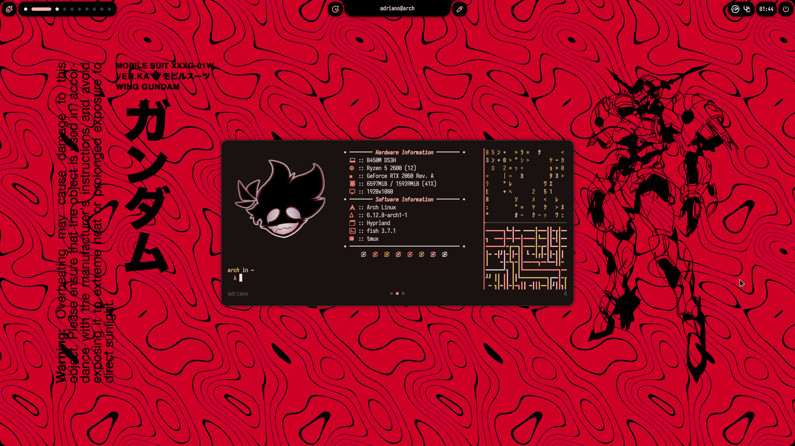
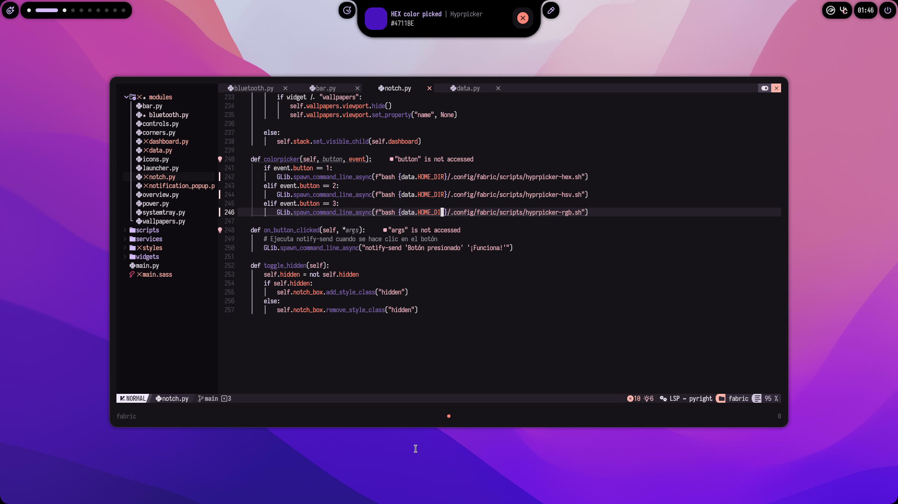
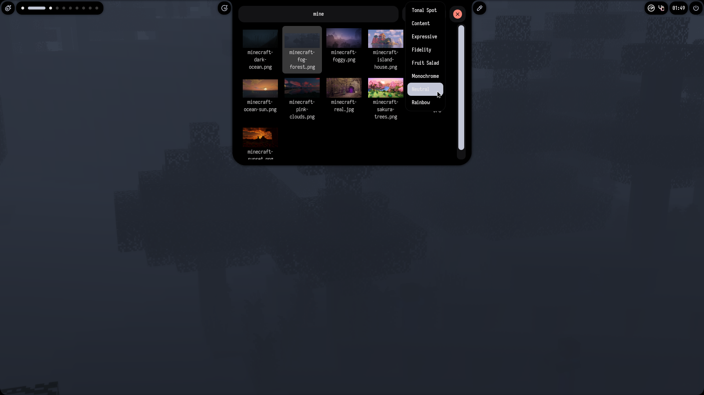
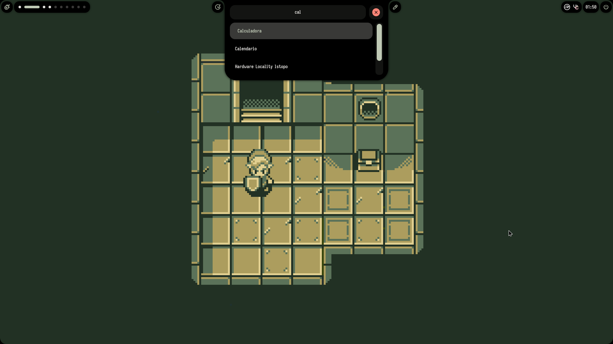
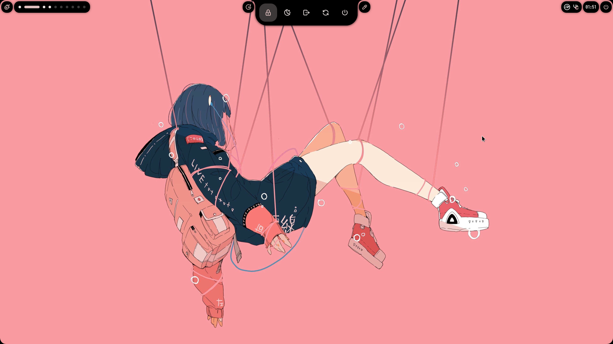

<p align="center">
<a href="https://github.com/Axenide/Ax-Shell">
  
  </a>
</p>

<p align="center">
  <sub><sup></sup></sub>
  <a href="https://github.com/hyprwm/Hyprland">
    
  </a>
  <a href="https://github.com/Fabric-Development/fabric/">
    
  <sub><sup></sup></sub>
  </a>
  </p>

  <p align="center">
  <a href="https://github.com/Axenide/Ax-Shell/stargazers">
    
  </a>
  <a href="https://ko-fi.com/Axenide">
    
  </a>
  <a href="https://discord.com/invite/gHG9WHyNvH">
    
  </a>
</p>

---

<h2><sub></sub> Screenshots</h2>
<table align="center">
  <tr>
    <td colspan="4"></td>
  </tr>
  <tr>
    <td colspan="1"></td>
    <td colspan="1"></td>
    <td colspan="1" align="center"></td>
    <td colspan="1" align="center"></td>
  </tr>
</table>

<h2><sub></sub> Installation</h2>

> [!NOTE]
> You need a functioning Hyprland installation.

### Arch Linux

> [!TIP]
> This command also works for updating an existing installation!


```bash
curl -fsSL https://raw.githubusercontent.com/Axenide/Ax-Shell/main/install.sh | bash
```

### Manual Installation
1. Install dependencies:
    - [Fabric](https://github.com/Fabric-Development/fabric)
    - [fabric-cli](https://github.com/Fabric-Development/fabric-cli)
    - [Gray](https://github.com/Fabric-Development/gray)
    - [Matugen](https://github.com/InioX/matugen)
    - `brightnessctl`
    - `cava`
    - `cliphist`
    - `gnome-bluetooth-3.0`
    - `gobject-introspection`
    - `gpu-screen-recorder`
    - `grimblast`
    - `hypridle`
    - `hyprlock`
    - `hyprpicker`
    - `hyprshot`
    - `hyprsunset`
    - `imagemagick`
    - `libnotify`
    - `noto-fonts-emoji`
    - `nvtop`
    - `playerctl`
    - `swappy`
    - `swww`
    - `tesseract`
    - `tmux`
    - `uwsm`
    - `webp-pixbuf-loader`
    - `wl-clipboard`
    - `wlinhibit`
    - Python dependencies:
        - ijson
        - numpy
        - pillow
        - psutil
        - requests
        - setproctitle
        - toml
        - watchdog
    - Fonts (automated on first run):
        - Zed Sans
        - Tabler Icons

2. Download and run Ax-Shell:
    ```bash
    git clone https://github.com/Axenide/Ax-Shell.git ~/.config/Ax-Shell
    uwsm -- app python ~/.config/Ax-Shell/main.py > /dev/null 2>&1 & disown
    ```

<h2><sub></sub> Roadmap</h2>

- [x] App Launcher
- [x] Bluetooth Manager
- [x] Calculator
- [x] Calendar
- [x] Clipboard Manager
- [x] Color Picker
- [x] Customizable UI
- [x] Dashboard
- [x] Dock
- [x] Emoji Picker
- [x] Kanban Board
- [x] Notifications
- [x] OCR
- [x] Pins
- [x] Power Manager
- [x] Power Menu
- [x] Screen Recorder
- [x] Screenshot
- [x] Settings
- [x] System Tray
- [x] Terminal
- [x] Tmux Session Manager
- [x] Vertical Layout
- [x] Wallpaper Selector
- [x] Workspaces Overview
- [ ] Multi-monitor support
- [ ] Multimodal AI Assistant
- [ ] Network Manager
- [ ] OTP Manager

---

<table align="center">
  <tr>
    <td align="center"><sup> sᴜᴘᴘᴏʀᴛ ᴛʜᴇ ᴘʀᴏᴊᴇᴄᴛ </sup></td>
  </tr>
  <tr>
    <td align="center">
      <a href='https://ko-fi.com/Axenide' target='_blank'>
        
      </a>
    </td>
  </tr>
</table>
